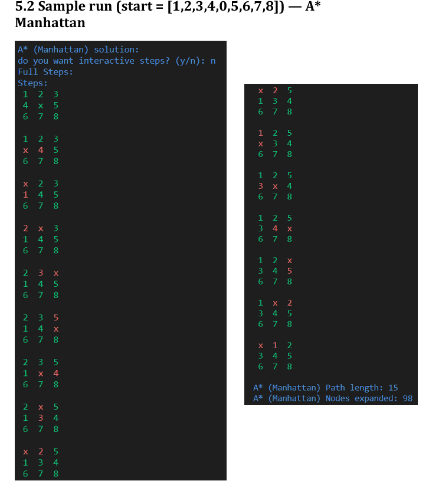

# 8‑Puzzle Search Strategies

## Project Overview

This project explores **classical AI search strategies** through the well‑known **8‑Puzzle problem**.

It focuses on how different algorithms traverse the search space, how heuristics guide informed search, and how these choices impact efficiency in practice.

Both **uninformed** (blind) and **informed** (heuristic‑based) approaches are implemented and evaluated using clear, reproducible experiments.

---

## Problem Description

The 8‑Puzzle is a sliding puzzle consisting of:

- A 3×3 grid
- Eight numbered tiles (1–8)
- One blank tile represented by **0**

At any step, the blank tile can be swapped with an adjacent tile (up, down, left, or right).

All moves have a **uniform cost of 1**.

**Goal configuration:**

```
0 1 2
3 4 5
6 7 8
```

The task is to find a valid sequence of moves that transforms an initial configuration into this goal state.

---

## Search Algorithms Implemented

### Uninformed Search

- **Breadth‑First Search (BFS)**  
  Guarantees optimal solutions but expands a very large number of states.

- **Depth‑First Search (DFS)**  
  Dives deep into the state space but does not guarantee optimal solutions.

- **Iterative Deepening DFS (IDDFS)**  
  Combines DFS space efficiency with BFS‑level completeness by gradually increasing the depth limit.

### Informed Search

- **A\*** Search with heuristic guidance: 
    - **Manhattan Distance**
    - **Euclidean Distance**

A* prioritizes nodes using `f(n) = g(n) + h(n)`, significantly reducing unnecessary exploration compared to blind methods.

---

## State Representation

Each board configuration is encoded as a **unique integer** using **factoradic (permutation) encoding**:

- Every permutation maps to an ID in **[0, 9! − 1]**
- Enables compact storage of explored states
- Allows fast parent tracking and reliable path reconstruction

Key utilities:

- `get_state(grid)` → converts a 3×3 grid into a unique state ID
- `get_grid(state_id)` → reconstructs the grid from its encoded state

This representation keeps memory usage predictable when exploring large parts of the search space.

---

## Heuristics Used in A*

### Manhattan Distance

Sum of horizontal and vertical distances between each tile's current and goal positions:

```
h = |x_current − x_goal| + |y_current − y_goal|
```

### Euclidean Distance

Straight‑line distance from the tile's current position to its goal position:

```
h = sqrt((x_current − x_goal)² + (y_current − y_goal)²)
```

Both heuristics are admissible, but their effectiveness differs noticeably in practice.

---

## Performance Snapshot

The table below summarizes performance on a challenging initial configuration:

`[8, 7, 6, 5, 4, 3, 2, 1, 0]`

| Algorithm         | Path Length | Nodes Expanded |
|-------------------|-------------|----------------|
| A* (Manhattan)    | 28          | **180**        |
| A* (Euclidean)    | 28          | 5,113          |
| BFS               | 28          | 177,224        |

**Key Insight:** Manhattan Distance guides the search far more efficiently, expanding orders of magnitude fewer nodes than Euclidean distance and uninformed methods.

---


## Example Run

**Figure — Sample A* (Manhattan) execution** showing step‑by‑step board transitions and final statistics.



This trace highlights how heuristic guidance quickly converges to an optimal solution while avoiding excessive exploration.

---

## Output & Visualization

The solver outputs:

- Full solution path from start to goal
- Step‑by‑step board configurations
- Total path cost
- Number of expanded nodes

Moves are rendered directly in the terminal, with visual emphasis on tile changes.

An optional **interactive mode** pauses execution between steps for inspection.

---

## Project Structure

```
.
├── main.py        # Search algorithms and utilities
├── README.md      # Project documentation
└── assets/        # Optional screenshots / figures
```

---

## How to Run

```bash
python main.py
```

You can modify the initial board configuration, select the search algorithm, and choose the heuristic (for A\*) directly inside `main.py`.

---

## Notes

- All actions have uniform cost
- Node expansion count is the most reliable metric for comparison
- The implementation prioritizes conceptual clarity and correctness over micro‑optimizations

---

## Author

**Abdelrhman Anwar**

Data and Analytics Engineer

---

This repository presents a clean, practical comparison of classical AI search techniques and their trade‑offs on a well‑defined problem.
